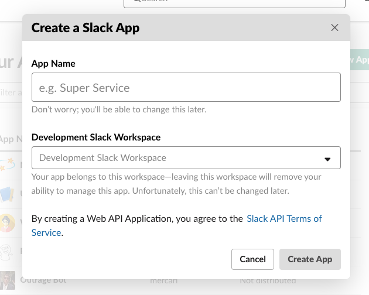
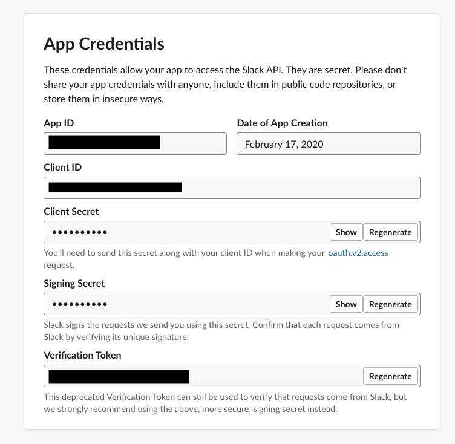
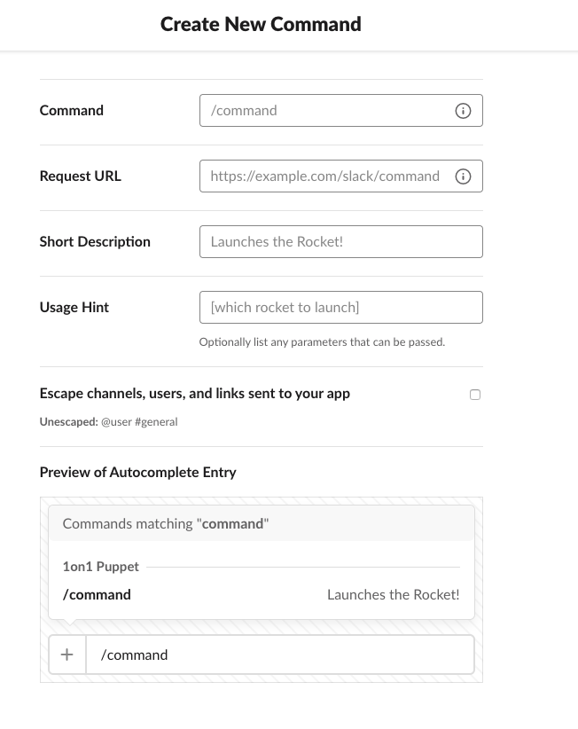
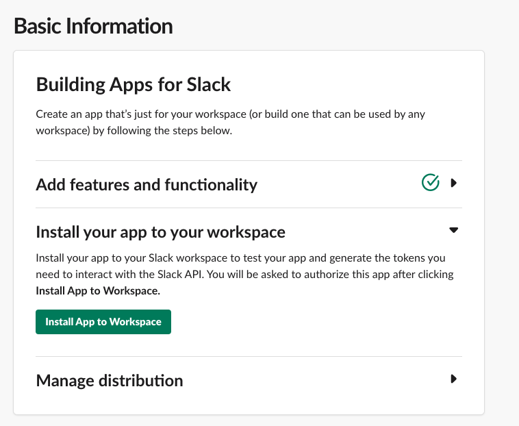

# 1on1 cheet Slack command

Originary the questions were from [VGraupera/1on1-questions](https://github.com/VGraupera/1on1-questions). Great work!

## How to deploy to your Slack workspace

### 1. Create a Slack bot

Go to [Slack API console](https://api.slack.com/apps) and click `Create New App`.



* App name: Whatever you like
* Development Slack Workspace: Your workspace to install

### 2. Configure `.env`

Create a `.env` file.

```console
$ cp .envrc .env
```

And then copy the value of `Signing Secret` and paste to `SLACK_SIGNING_SECRET` in `.env`.



### 3. Deploy to Cloud Run

Click this button below. 

[](https://deploy.cloud.run)

Select ...

* GCP Project name
* Region to deploy

Copy the URL of your deployment.

### 4. Configure the Slash command

Configure you slash command and press `save`.

* Command: Your trigger command name
* Request URL: Paste your Cloud Run's deployment URL and add `/cheet`
* Short Description: Tell your users what this can do
* Usage hint: Enter `help`



### 5. Install your Slack bot

Finally, install your bot into your actual workspace.



---

## Contribute

I welcome any contribution:) Please submit a pull request.

## Notes

* See `LICENSE` for the licensing information.

## Author

* [KeisukeYamashita](https://github.com/KeisukeYamashita)
